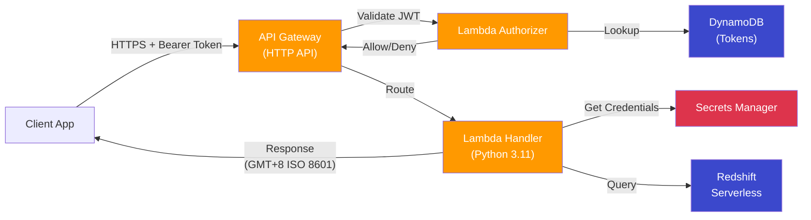

# Architecture Diagrams

## 1. Current Architecture — Transaction History API

```mermaid
flowchart TB
    subgraph Clients["Client Applications"]
        APP1["Transaction History\nConsumer App"]
    end

    subgraph AWS["AWS Cloud (ap-southeast-1)"]
        subgraph APIGW["Amazon API Gateway v2 (HTTP API)"]
            ROUTE1["POST /v1/api/generate_token"]
            ROUTE2["POST /v1/api/transactions"]
            ROUTE3["GET /v1/api/transactions/{retRefNo}"]
            ROUTE4["POST /v1/api/wallet-transaction-history"]
            ROUTE5["POST /v1/api/remittance-transaction-history"]
            ROUTE6["POST /v1/api/qr-emvco-transaction-history"]
            ROUTE7["POST /v1/api/ibank-fund-transfer-history"]
            ROUTE8["POST /v1/api/corporate-transaction-history"]
            ROUTE9["POST /v1/api/pesonet-transaction-history"]
            ROUTE10["POST /v1/api/bulk-pepp-disbursement-history"]
        end

        subgraph AUTH["Authentication Layer"]
            AUTHORIZER["Lambda Authorizer\n(cauth_token)"]
            DDB["DynamoDB\n(cauth_tokens)"]
        end

        subgraph VPC["VPC (Private Subnets)"]
            subgraph LAMBDA["Lambda Functions (Python 3.11)"]
                GEN_TOKEN["generate_cauth_token"]
                TXN["transaction_history_logs"]
                TXN_VIEW["transaction_view"]
                WALLET["wallet_transaction"]
                REMIT["remittance_transaction"]
                QR["qr_emvco_transaction"]
                IBANK["ibank_ft_transaction"]
                CORP["corporate_transaction"]
                PESO["pesonet_transaction"]
                BULK["bulk_pepp_disbursement"]
            end

            subgraph DATA["Data Layer"]
                SM["Secrets Manager\n(Redshift Credentials)"]
                RS["Amazon Redshift\nServerless"]
            end

            VPCE_SM["VPC Endpoint\n(Secrets Manager)"]
            VPCE_RS["VPC Endpoint\n(Redshift Data)"]
        end

        CW["CloudWatch Logs"]
        LAYER["Lambda Layer\n(psycopg2, pydantic, PyJWT)"]
    end

    APP1 -->|"HTTPS Request"| APIGW
    APIGW -->|"Authorization\nCheck"| AUTHORIZER
    AUTHORIZER -->|"Lookup Token"| DDB
    AUTHORIZER -->|"Allow/Deny"| APIGW

    ROUTE1 --> GEN_TOKEN
    GEN_TOKEN -->|"Store Token"| DDB

    ROUTE2 --> TXN
    ROUTE3 --> TXN_VIEW
    ROUTE4 --> WALLET
    ROUTE5 --> REMIT
    ROUTE6 --> QR
    ROUTE7 --> IBANK
    ROUTE8 --> CORP
    ROUTE9 --> PESO
    ROUTE10 --> BULK

    TXN --> VPCE_SM --> SM
    TXN --> VPCE_RS --> RS
    WALLET --> VPCE_SM
    WALLET --> VPCE_RS
    REMIT --> VPCE_SM
    REMIT --> VPCE_RS

    LAMBDA --> CW
    LAMBDA -.->|"Shared Dependencies"| LAYER
```

---

## 2. Current Architecture — Simplified View

```mermaid
flowchart LR
    CLIENT["Client App"] -->|"HTTPS + Bearer Token"| APIGW["API Gateway\n(HTTP API)"]
    APIGW -->|"Validate JWT"| AUTH["Lambda Authorizer"]
    AUTH -->|"Lookup"| DDB["DynamoDB\n(Tokens)"]
    AUTH -->|"Allow/Deny"| APIGW
    APIGW -->|"Route"| LAMBDA["Lambda Handler\n(Python 3.11)"]
    LAMBDA -->|"Get Credentials"| SM["Secrets Manager"]
    LAMBDA -->|"Query"| RS["Redshift\nServerless"]
    LAMBDA -->|"Response\n(GMT+8 ISO 8601)"| CLIENT

    style APIGW fill:#FF9900,color:#fff
    style AUTH fill:#FF9900,color:#fff
    style LAMBDA fill:#FF9900,color:#fff
    style DDB fill:#3B48CC,color:#fff
    style SM fill:#DD344C,color:#fff
    style RS fill:#3B48CC,color:#fff
```